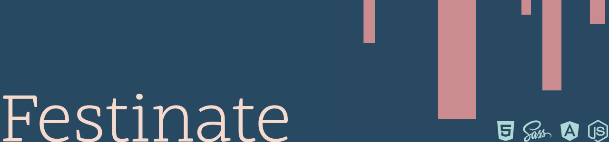

[Heroku](https://festinate.herokuapp.com/)

[GitHub Repo](https://github.com/platypotomus/festival-companion-app)

Festinate is a one-page, full-stack festival companion app, designed for mobile first. Users have access to a variety of features, such as adding festivals, adding and deleting other users as friends, and creating and managing car shares. It also features external APIs to offer useful, up-to-date information about the festival.

Festinate was my third project done on General Assembly's Web Development Immersive. It was my first go at MEAN stack technologies. Festinate was a group project that I built with two colleagues in ten days.

Each one of us had a hand on every aspect of the project, from back end and testing, to front end and styling.

#### Welcome/Login
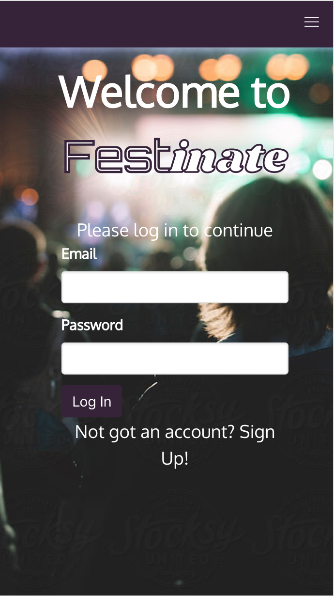

#### Festival Index
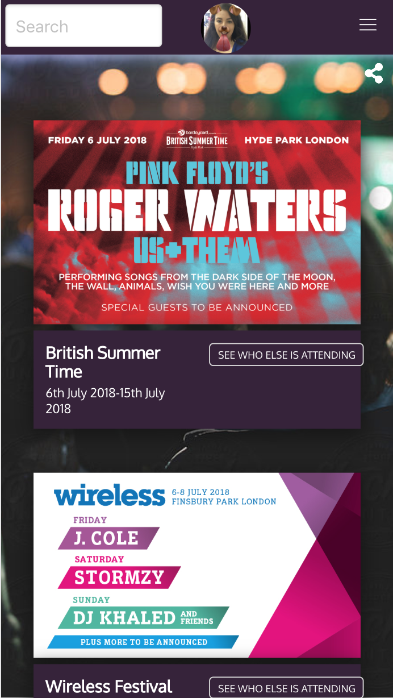

#### Festival Show
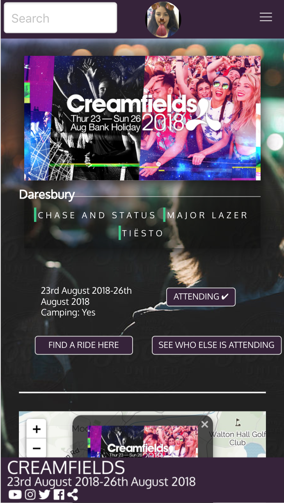

#### Car Share Index
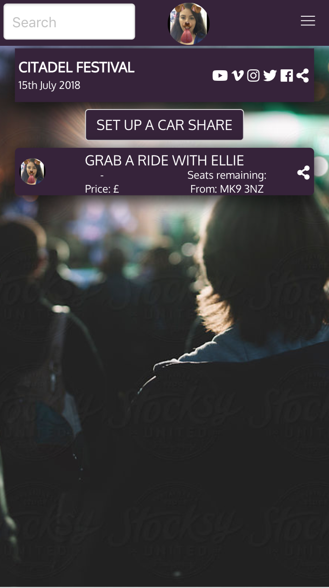

#### User Index
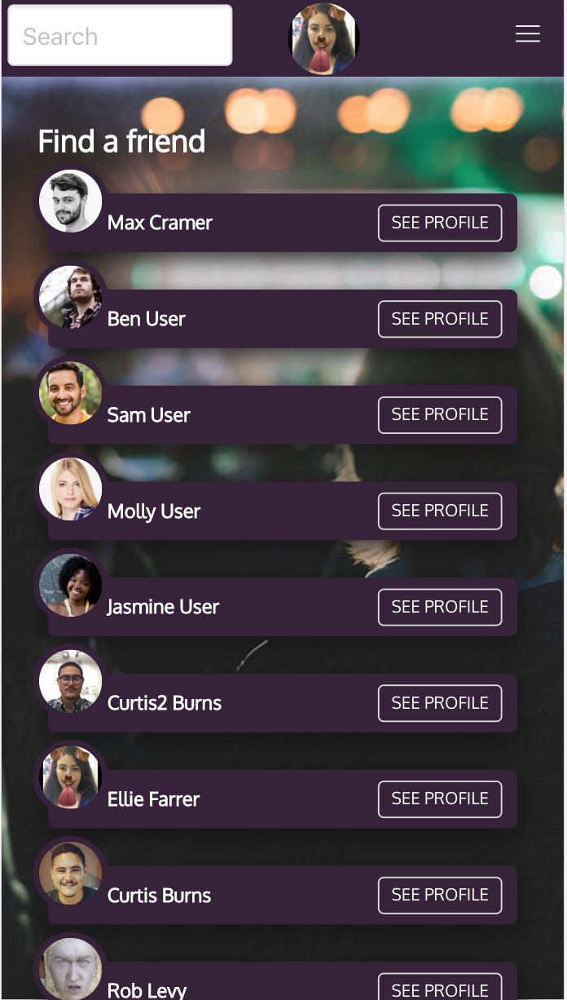

#### Profile Page
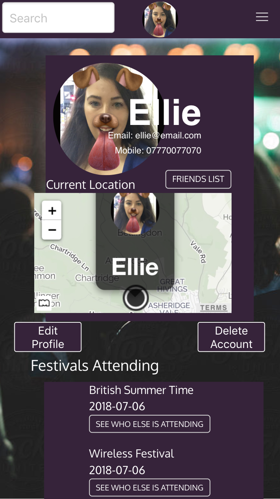

---

## Brief
Your instructors will partner you with other classmates to design and collaboratively build a MEAN stack app of your own design.

Your app must:
* Use Mongo, Node & Express to build a server-side API
* Your API must have at least 2 related models, one of which should be a user
* Your API should include all RESTFUL actions for at least one of those models
* Include authentication to restrict access to appropriate users
* Include at least one referenced or embedded sub-document, however don't go crazy! You need to manage your time effectively...
* Include automated tests for at least one resource
* Use Angular to build a front-end that consumes your API
* Use SCSS instead of CSS
* Use Webpack & Yarn to manage your dependencies and compile your source code

## Technologies Used
* HTML5
* SCSS
* JavaScript(ECMAScript 6)
* Node.js
* angular: v1.7.3
* @uirouter/angularjs: v1.0.20
* bulma: v0.7.1
* moment: v2.22.2
* satellizer: v0.15.5
* MongoDB
* bcrypt: v3.0.0
* bluebird: v3.5.1
* body-parser: v1.18.3
* express: v4.16.3
* jsonwebtoken: v8.3.0
* mongoose: v5.2.8
* morgan: v1.9.0
* request-promise: v4.2.2
* chai: v4.1.2
* mocha: v5.2.0
* nyc: v12.0.2
* supertest: v3.1.0
* Git
* GitHub
* Heroku
* Trello
* Sketch
* Marvel
* Google Fonts
* Fontawesome

## APIs Used
* Dark Skies
* Filestack
* Mapquest
* Nominatim

## Approach Taken

### Wireframes
We began wireframing on Sketch, using a Sketch template as a guide. We then moved to [Marvel](https://marvelapp.com/428e1e4/screen/46835471) to link the pages up.

#### Login
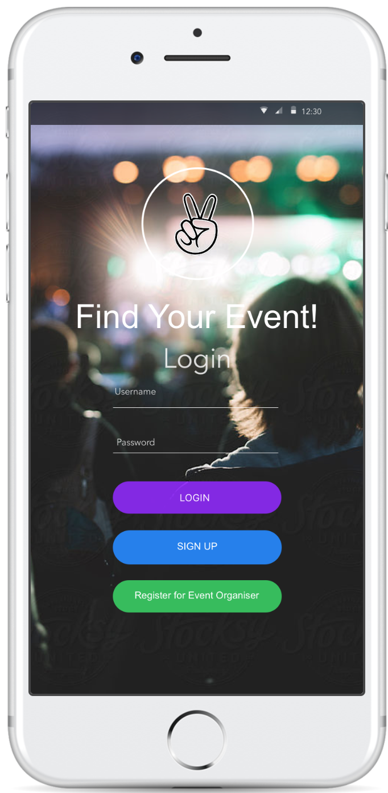

#### Festivals Index
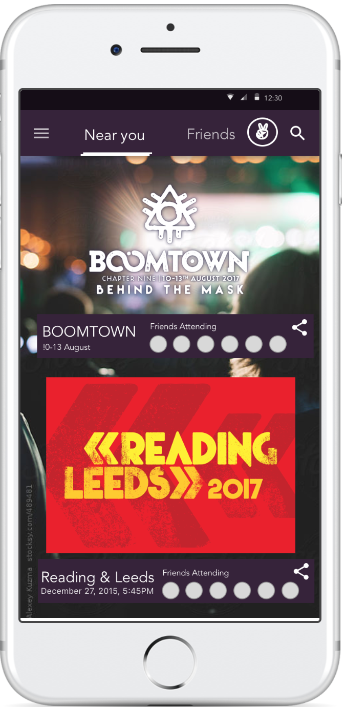

#### Festivals Show
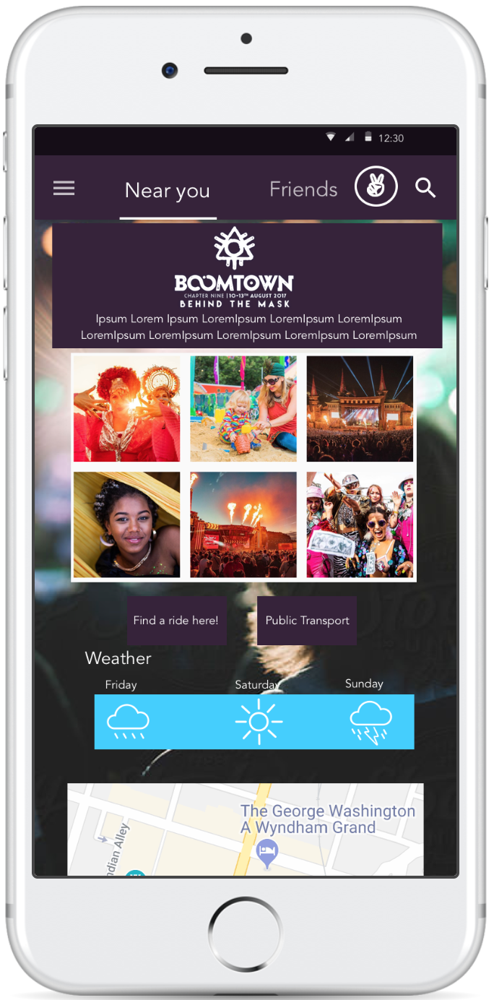

##### Car Shares Index
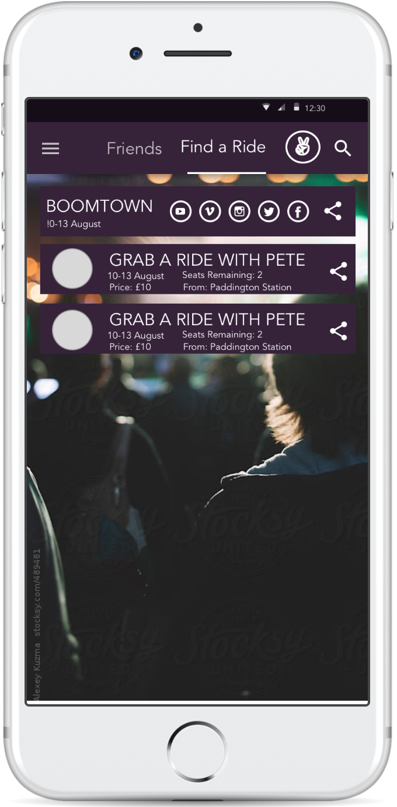

##### Profile Page
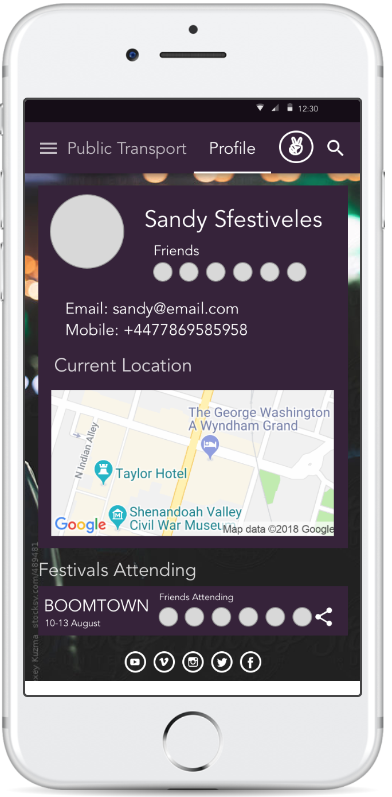

### Functionality
We began by building and testing the back end, to make sure it was solid. First, we worked on getting the basic RESTful routes working for users, festivals, and car shares; before moving onto extras such as friend and passenger requests.

Next came front end, followed by external APIs. Whilst everyone had a role in every part of the app, I found myself focussing on these APIs towards the end of the project, handling every one of them apart from Filestack.

### Styling
We chose a black and dark purple for our colour scheme. The typography is made up of three Google fonts: Orbitron and Shrikhand for the logo, and Oxygen for everything else. Because the app needed to be mobile first (due to the nature of the app itself), we used Bulma to take advantage of its cross-device capabilities. At the time of delivery, Festinate was optimised for iPhone 8, and worked on phones of similar screen sizes. However it was not styled so well for larger or smaller screens (e.g. iPhone 5).

## Wins and Blockers
As a team, I would say the styling was a huge win. We were all really pleased with the design from that of the small components, to the bigger picture.

OUr biggest blocker was getting friend requests, passenger requests, and attendees working on both the front and back ends. In hindsight, it would have been better to start this earlier on, and to use objects instead of arrays.

In terms of the elements I built, the biggest win was working with the APIs. I had dabbled with both Nominatim and Dark Skies before, but MapQuest was completely new. It took a little time to get to grips with, but its beautiful tiles and markers - coupled with its many different endpoints - were a wonderful reward. Getting the Skycons working on Dark Skies was also a challenge, but one that was very visually rewarding.

My biggest blocker was testing. I had only done this a little bit before, so it was hard to know if the test was written incorrectly, or if the code was wrong when the tests broke. It was also hard to know exactly what to test for, particularly on the authentication side.

## Future Features
There are a number of extra features we would like to add, including:

* Sending SMS or emails from the app about car shares, perhaps using an API like Twilio.
* Integrating the TfL API and Transport API to give users access to public transport timetables and service updates.
* Another map feature which allows festival organisers to place points on the site to mark the stage(s), toilets, entrances/exits etc. Then the user could mark the location of their tent, and navigate around the site more easily.
* Improve the friends feature so users gain certain permissions to view another user's profile etc when they're friends.
* An in-app instant messenger.
* Improve the car share map feature.
* Improve the responsiveness.
